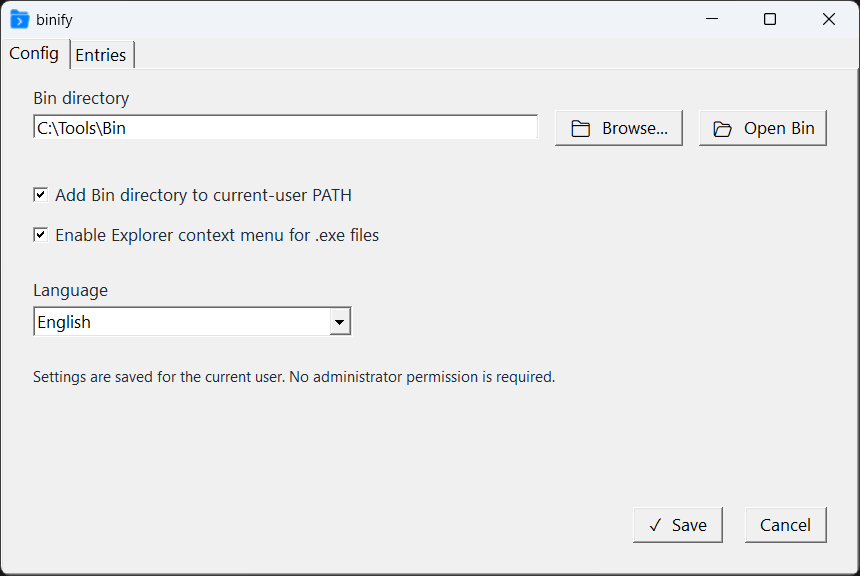
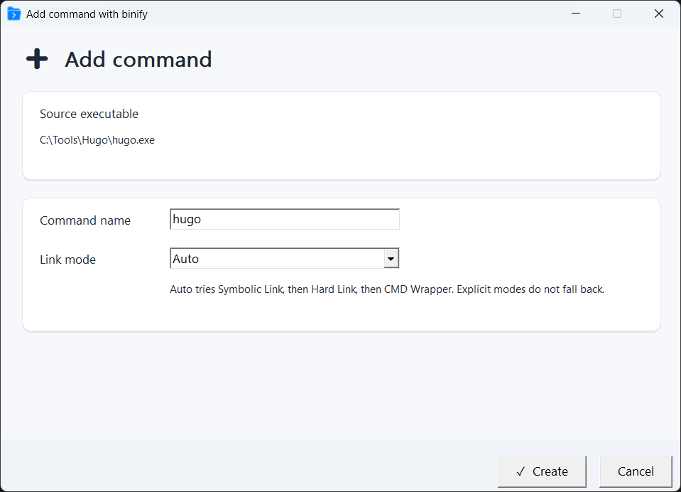
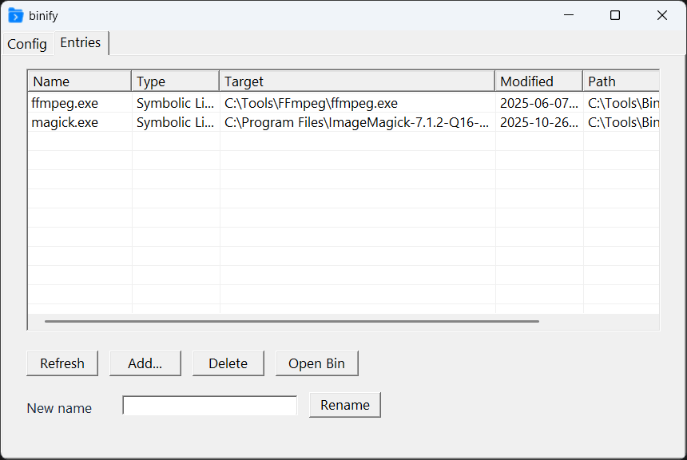
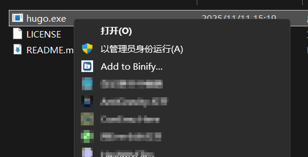

# binify

`binify` 是一个轻量级 Windows 工具，用来把桌面程序的 `.exe` 变成可在命令行里直接调用的命令入口。

你只需要选择一个 Bin 目录，把它加入当前用户的 `PATH`，然后通过右键菜单把 `.exe` 添加为命令。`binify` 可以用符号链接、硬链接或简单的 CMD wrapper 创建入口。

[English README](README.md)

## 截图



| 添加命令 | 管理条目 |
| --- | --- |
|  |  |



## 功能

- 将可执行文件添加到用户管理的 Bin 目录。
- 可选择把 Bin 目录加入当前用户 `PATH`。
- 可为 `.exe` 文件添加资源管理器右键菜单。
- 支持多种入口创建方式：
  - Auto
  - Symbolic link
  - Hard link
  - CMD wrapper
- 检测重名命令，并提示覆盖或取消。
- 自动规范化命令名，生成安全的 Windows 命令入口。
- 查看、刷新、重命名、删除和打开已有 Bin 条目。
- 从外部 JSON 文件读取语言包。
- 默认按当前用户安装和配置，不需要管理员权限。

## 下载

请从 GitHub Releases 页面下载最新版安装包。

推荐：

- 大多数现代 Windows 电脑使用 `binify-*-windows-x64.exe`。
- 32 位 Windows 使用 `binify-*-windows-x86.exe`。

## 系统要求

- 推荐 Windows 10 或更高版本。
- 支持 x64 和 x86 构建。
- 部分链接方式受 Windows 权限和文件系统限制：
  - Symbolic link 可能需要开启开发者模式或具备相应权限。
  - Hard link 要求源文件和 Bin 目录位于同一个卷。
  - CMD wrapper 会生成简单的 `.bat` 文件，兼容性最好，适合作为兜底方式。

## 基本使用

1. 打开 `binify`。
2. 选择一个 Bin 目录，例如：

   ```text
   C:\Tools\Bin
   ```

3. 如果希望命令在任意终端中可用，勾选“将 Bin 目录加入当前用户 PATH”。
4. 如果希望通过右键添加命令，勾选 `.exe` 文件右键菜单。
5. 保存设置。
6. 在资源管理器中右键一个 `.exe` 文件，选择 binify 操作。
7. 确认命令名和链接方式。

之后打开一个新的终端，就可以直接运行创建的命令。

示例：

```powershell
ffmpeg
```

如果终端是在修改 `PATH` 之前打开的，需要重新打开终端。

## 管理条目

打开 `Entries` 页面可以：

- 刷新 Bin 目录扫描结果。
- 添加新的可执行文件。
- 删除已有入口。
- 重命名入口。
- 在资源管理器中打开 Bin 目录。

删除条目只会删除 Bin 目录中的生成入口，不会删除原始程序。

## 从源码构建

依赖：

- Visual Studio 2026，包含 C++ 桌面开发工具。
- CMake 3.28 或更高版本。
- Git。
- Inno Setup，仅在需要生成安装包时使用。

构建并测试 Debug 版本：

```powershell
cmake --preset windows-x64-debug
cmake --build --preset windows-x64-debug
ctest --preset windows-x64-debug --output-on-failure
```

构建 Release：

```powershell
cmake --preset windows-x64-release
cmake --build --preset windows-x64-release --target binify
```

使用 Inno Setup 生成安装包。如果 `ISCC.exe` 已经在 `PATH` 中，可以直接调用；如果使用便携版，本项目约定路径是 `third_party\innosetup\bin\ISCC.exe`。

```powershell
.\third_party\innosetup\bin\ISCC.exe .\installer\binify.iss /DAppArch=x64
```

安装包输出目录：

```text
out\installer
```

## 多语言

语言文件是 JSON 文件，位于：

```text
resources\lang
```

安装后语言包会复制到：

```text
<install-dir>\lang
```

新增语言时，只需要添加新的 JSON 语言包，不需要重新编译程序。

## 许可证

第三方组件声明见 [THIRD_PARTY_NOTICES.md](THIRD_PARTY_NOTICES.md)。
